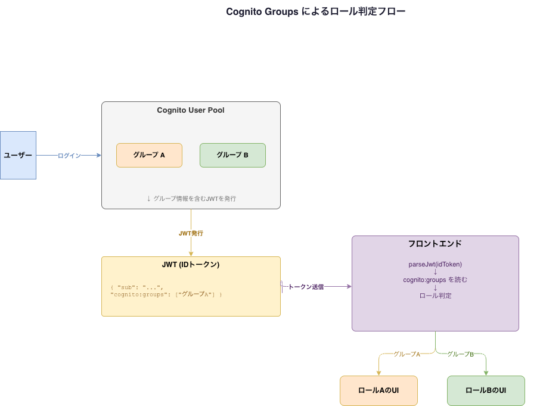

今日は2つのデバッグをした。ひとつはCSSの地雷、もうひとつはAWSの認証基盤まわり。どちらも原因がわかれば「なるほど」で終わるが、そこに至るまでが消耗する。

<!-- truncate -->

---

## CSSのスタッキングコンテキスト地雷

### 症状

スマホでハンバーガーメニューを押すと、ヘッダーだけが動いてメニューの中身が一切出てこない。あるいは、ページが横にずれてフリーズする。

フレームワークが生成するUIなのに壊れている、しかも原因は自分が書いた別のCSSだった、というパターン。

---

### 地雷1: `overflow-x: hidden` をルートに置く

横スクロールを防ぐためによく書かれる一行。

```css
html, body {
  overflow-x: hidden;
}
```

一見無害に見えるが、**`html` に `overflow-x: hidden` を書くと `position: fixed` の基準が変わる**という副作用がある。

通常、`position: fixed` の要素はブラウザのビューポートを基準に配置される。ところが `overflow-x: hidden` を `html` に適用すると、`html` 要素自体がビューポートの代わりに包含ブロック（containing block）になる。サイドバーやモーダルなど `position: fixed` で動くUIが、期待通りの場所に現れなくなる。

**どう直すか**

`html` からは外すこと。横スクロールが出ているなら、原因になっている要素（はみ出しているコンテンツ）を特定して直す方が根本解決になる。

```css
/* ❌ html への overflow-x: hidden は副作用がある */
html { overflow-x: hidden; }

/* ✅ 必要なら body だけに留める（それでも副作用はある） */
/* 本当ははみ出し元を直す方がいい */
```

---

### 地雷2: `backdrop-filter` がスタッキングコンテキストを作る

ナビバーにすりガラス効果をつけると、内部のUIが壊れることがある。

```css
.navbar {
  backdrop-filter: blur(12px);
}
```

原因は**スタッキングコンテキスト（stacking context）**だ。

「スタッキングコンテキスト」とは、CSS の重なり順（z-index）を決めるグループのことだ。`backdrop-filter` を持つ要素は新しいスタッキングコンテキストを作る。すると、その子要素は「親グループの中だけで」重なり順を争うことになり、グループの外（ページ本体）に飛び出せなくなる。

Docusaurusのモバイルサイドバーはナビバーの子要素として存在する。ナビバーが `backdrop-filter` でスタッキングコンテキストを作ると、サイドバーがナビバーの「枠の中」に閉じ込められ、全画面に広がれなくなる。

**どう直すか**

`backdrop-filter` を要素本体ではなく `::before` 疑似要素に移す。こうすると、ナビバー本体はスタッキングコンテキストを作らず、子要素が自由に重なれる。

```css
/* ❌ navbar 本体に backdrop-filter → 子要素が閉じ込められる */
.navbar {
  backdrop-filter: blur(12px);
  background: rgba(0, 0, 0, 0.8);
}

/* ✅ ::before に移動 → navbar はスタッキングコンテキストを作らない */
.navbar {
  background: transparent;
}

.navbar::before {
  content: '';
  position: absolute;
  inset: 0;
  backdrop-filter: blur(12px);
  background: rgba(0, 0, 0, 0.8);
  z-index: -1;
}
```

---

### 覚えておくと役立つ：スタッキングコンテキストを作るCSS

「なぜかUIが壊れる」ときの犯人になりやすいプロパティ一覧。

| プロパティ | 条件 |
|---|---|
| `opacity` | `1` 未満のとき |
| `transform` | `none` 以外のとき |
| `filter` | `none` 以外のとき |
| `backdrop-filter` | `none` 以外のとき |
| `position` | `z-index` が `auto` 以外のとき |
| `will-change` | 上記を指定したとき |

モーダルやドロップダウン、スライドインメニューが「なぜか表示されない・重なりがおかしい」ときは、親要素のこれらを疑うと手がかりになる。

---

## Cognito Groupsでロールを管理する

### 背景

受講生とインストラクターが使うサービスを作っていて、ロールによって見えるUIを変えたい。受講生には受講メニューを、インストラクターにはコンテンツ管理画面を。

サーバーレス構成なのでバックエンドを持ちたくない。認証にはAWS Cognitoを使っている。

### 選択肢を整理した

| 方法 | 概要 | 問題点 |
|---|---|---|
| カスタム属性 | `custom:role` をユーザー属性に持たせる | ユーザー自身が書き換えられるリスク |
| Cognito Groups | グループにアサイン、JWTに自動反映 | 管理者のみ変更可能、サーバー不要 |
| 外部DB | DynamoDBなどでロール管理 | バックエンドが必要になる |

今回はCognito Groupsを選んだ。

### 仕組みはシンプル



Cognitoでグループを作り、ユーザーをアサインすると、そのユーザーのIDトークン（JWT）に `cognito:groups` クレームが自動で入る。

```json
{
  "sub": "xxxx",
  "email": "instructor@example.com",
  "cognito:groups": ["instructors"]
}
```

フロントはこれを読んでロールを判定する。

```typescript
const payload = parseJwt(idToken)
const groups: string[] = payload['cognito:groups'] ?? []
const role = groups.includes('instructors') ? 'instructor' : 'student'
```

グループへの追加・削除は管理者しかできないので、カスタム属性より安全だ。

### 注意点

JWTのペイロードはBase64エンコードされているだけで、誰でも読める。**フロントのロール判定はあくまでUIの出し分けに限定する**こと。

```
フロント: ロールに応じてUIを出し分ける（表示制御）
バックエンド: JWTを検証してAPIアクセスを制御（認可）
```

重要なAPIへのアクセス制御は必ずバックエンド側（API GatewayのオーソライザーやLambda）で行う。フロントだけで認可を完結させると、JWTを改ざんされたときに突破される。

---

## 今日の感想

CSSの地雷は「なぜ壊れるか」の仕組みを知っていると格段に早く直せる。スタッキングコンテキストの概念は最初ピンとこないが、「重なりのグループ」とイメージするとわかりやすい。

Cognito Groupsはシンプルで使いやすかった。ロールが増えてきたり権限が複雑になってきたらDynamoDBと組み合わせることになるが、今のフェーズはこれで十分だ。

*Live with a Smile!*
